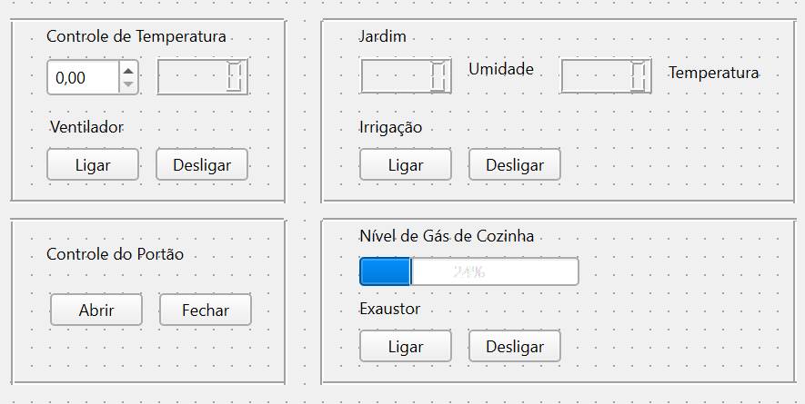

# Programação Orientada a Objetos

Este repositório é destinado para a documentação do projeto da disciplina de Programação Orientada a Objetos (PRG22107).

O objetivo do projeto é criar uma interface voltada para o controle e configurações das funções de uma residência automatizada.

Funções:

Controle de temperatura de algum cômodo, utilizando sensor de temperatura DHT11 e um micro-ventilador.
Controle de irrigação do jardim, utilizando o sensor de nível da água da chuva e uma mini bomba d'água.
Controle do portão, utilizando um servomotor.
Controle de gás de cozinha, utilizando o sensor de gás MQ-2 e um micro-ventilador para simular um exaustor.

Os dados dos sensores e atuadores serão manipulados pelo Arduino MEGA 2560 R3 e via serial os dados serão enviados para o desktop.

## Interface 

